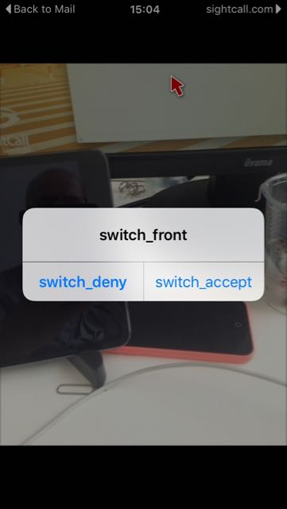
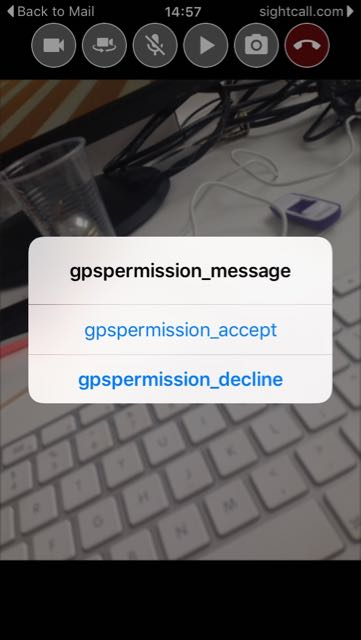
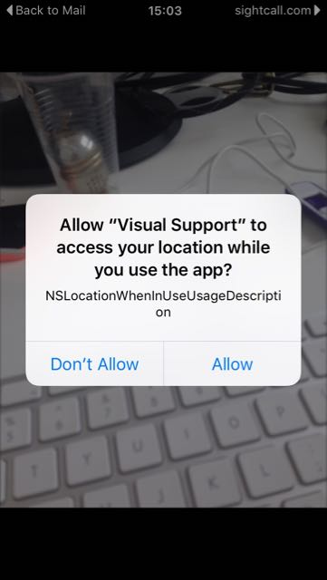
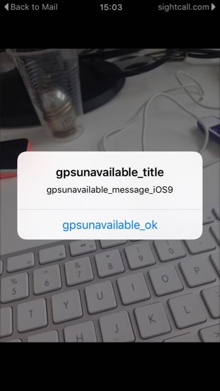
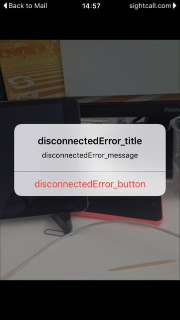

## Generic

| Key | Description | EN | FR | ES |
| --- | --- | --- | --- | ---|
| default_displayname | Default name of an external | Visitor |Visiteur |Invitado |

## Media share:

| Key | Description | EN | FR | ES |
| --- | --- | --- | --- | ---|
| video_both_disabled | Text displayed centered in the call view controller when no video streams nor share are disabled |Both video streams are disabled|Tous les flux vidéos sont désactivés |Ambas transmisiones de vídeo están desactivadas |
| pickerAlert_title | Title of the Popup appearing on media share | Share: |Partagez: |Enviar |
| pickerAlert_sharePhoto | Entry of the Popup appearing on media share - displays a list of available pictures in the library|Select a Picture |Choisissez une Photo |Seleccione una foto |
| pickerAlert_shareVideo | Entry of the Popup appearing on media share - displays a list of available videos in the library | Select a Video |Choisissez une Vidéo |Seleccione un vídeo |
| pickerAlert_take | Entry of the Popup appearing on media share - displays the viewfinder to take a picture | Take a Picture |Prenez une Photo |Hacer foto |
| pickerAlert_cancel |Entry of the Popup appearing on media share - Cancels the operation | Cancel | Annuler|Cancelar |

## Camera switch:

| Key | Description | EN | FR | ES |
| --- | --- | --- | --- | ---|
| switch_rear | Camera swith demand - can the app use the rear camera | Switch to rear camera? |Basculer sur la caméra arrière? | Cambiar a cámara frontal|
| switch_front |Camera swith demand - can the app use the front camera | Switch to front camera? |Basculer sur la caméra avant? | Cambiar a cámara trasera|
| switch_deny | Camera swith demand - Deny the use of the camera specified above| Deny |Refuser |No permitir |
| switch_accept |Camera swith demand - Accept the use of the camera specified above | Accept |Accepter | Permitir|

## GPS Localization:

| Key | Description | EN | FR | ES |
| --- | --- | --- | --- | ---|
| gpspermission_message | GPS use demand - can we send the user's location| Share your location (GPS) with your current contact during 1 minute? |Partagez votre localisation (GPS) avec votre contact pendant 1 minute. |Compartir localización GPS con el interlocutor durante 1 minuto? |
| gpspermission_decline | GPS use demand - to decline sharing your position | Decline |Refuser |Denegar |
| gpspermission_accept | GPS use demand - to accept sharing your position | Accept |Accepter |Aceptar |

| Key | Description | EN | FR | ES |
| --- | --- | --- | --- | ---|
| NSLocationWhenInUseUsageDescription | GPS use demand - This text is displayed in the system popup asking the user if GPS use is allowed| Share your location (GPS) with your current contact during 1 minute.|Partagez votre localisation (GPS) avec votre contact pendant 1 minute. | |

| Key | Description | EN | FR | ES |
| --- | --- | --- | --- | ---|
| gpsunavailable_title | GPS use denied -  Title of the popup | Location Unavailable |Localisation indisponible |Localización no disponible. |
| gpsunavailable_message_iOS8 |GPS use denied - text of the popup in iOS 8- | The App is not allowed to get your location.\nPlease go to Settings → Privacy → Location Services to allow it. |L'application n'est pas autorisée à récupérer votre localisation.\nAllez dans Réglages → Confidentialité → Service de localisation pour l'autoriser. |No se ha permitido a la App obtener su localización.\nVaya a Configuración → Privacidad → Localización para su autorización. |
| gpsunavailable_message_iOS9 |GPS use denied - text of the popup in iOS 9+ | The App is not allowed to get your location.\nPlease go to Settings to allow it. |L'application n'est pas autorisée à récupérer votre localisation.\nAllez dans Réglages pour l'autoriser. |No se ha permitido a la App obtener su localización.\nVaya a Configuración para su autorización. |
| gpsunavailable_ok | GPS use denied -  Dismiss the popup | OK |OK |Aceptar|

## Connection issue:

| Key | Description | EN | FR | ES |
| --- | --- | --- | --- | ---|
| disconnectedError_title | Limited Connectivity - title of the popup informing the user that network connection was lost| Reconnecting ... |Reconnexion ... |Conectando de nuevo... |
| disconnectedError_message | Limited Connectivity - Informs the user that the app will retry connecting during the next %d seconds. | %ds before closing. |%ds avant déconnexion. | %ds para cerrar.|
| disconnectedError_button | Limited Connectivity - Cancel the reconnection attempt. | Cancel | Annuler|Cancelar |

