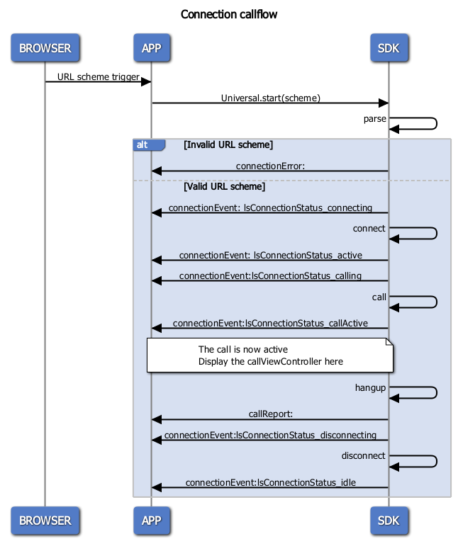

# iOS SDK

<!-- MarkdownTOC levels="2,3,4" autolink="true" -->

- [Dependencies](#dependencies)
- [Installation](#installation)
    - [Xcode Integration](#xcode-integration)
    	- [CocoaPods](#cocoapods)
    	- [Fat Framework](#fat-framework)
    	- [Update project with CocoaPods](#update_project_with_cocoapods)
    - [Swift support](#swift-support)
    - [Bitcode](#bitcode)
    - [Permissions](#permissions)
        - [Architecture](#architecture)
- [Usage](#usage)
    - [Instantiation](#instantiation)
    - [Delegation](#delegation)
        - [Connection and Calls](#connection-and-calls)
    - [Consent UI](#consent-ui)
    - [Start a Call](#start-a-call)
    - [Call UI](#call-ui)
        - [Customization](#customization)
    - [ACD information](#acd-information)
    - [Survey](#survey)
    - [Callflows](#callflows)
    - [Agent](#agent)
        - [Onboarding](#onboarding)
        - [Registration](#registration)
        - [Notifications](#notifications)
        - [Unregister](#unregister)
        - [Identity](#identity)
        - [Usecases](#usecases)
        - [Inviting a Guest](#inviting-a-guest)
        - [Invitation history](#invitation-history)
        - [Save picture](#save-picture)
- [Advanced](#advanced)
    - [Logging](#logging)
    - [Localization](#localization)

<!-- /MarkdownTOC -->

## Dependencies

This Framework ships with its own dependencies:

|        Name         | Version | 
| :-----------------  | :-----  |
| AFNetworking        |  3.2.1  |
| MMWormhole          |  2.0.0  |
| libPhoneNumber      |  0.9.13 |
| FormatterKit        |  1.9.0  |
| MaterialComponents        |  119.5.0  |


## Installation

### Xcode Integration

#### CocoaPods

[CocoaPods](https://cocoapods.org/) is the easiest way to get started (if you're new to CocoaPods, check out their [getting started documentation](https://guides.cocoapods.org/using/getting-started.html).)

To install CocoaPods, run the following commands:

```shell
$ sudo gem install cocoapods
```

To integrate LSUniversalSDK into your Xcode project using CocoaPods, specify it in your Podfile:


> **Requirements**: 

- CocoaPods version >= 1.10.0
- Xcode 11 and above
- Swift 5.1 and above


```shell
platform :ios, '9.0'
source 'https://github.com/CocoaPods/Specs.git'

target '<Your Target Name>' do
    pod 'LSUniversalSDK', :git => 'https://github.com/sightcall/iOS-UniversalSDK.git'
end
```

Then, run the following command:

```shell
$ pod install
```

> **PS**: CocoaPods will install LSUniversalSDK as XCFramework 

**What Is an XCFramework?**

The XCFramework format allows developers to conveniently distribute binary libraries for multiple platforms and architectures in a single bundle. For example, with XCFrameworks, vendors no longer need to merge (lipo) multiple architectures into a single binary, only to later have to remove the Simulator slice during the archive phase.

#### Fat Framework

To add this Framework to your project, clone it from Github using a tag:

```shell
$ git clone https://github.com/sightcall/iOS-UniversalSDK.git -t <YOUR TAG>
```

Then add `LSUniversalSDK.framework` in your Xcode project (Drag and drop the Framework in your Project Navigator or See [Apple Documentation](https://help.apple.com/xcode/mac/8.0/#/dev51a648b07)).

> **Xcode 12.3 issue**: iOS and iOS Simulator code has never been supported in the same binary 

The problem is that the USDK framework contains a build for both the simulator (x86_64) and the actual devices (ARM).

The only correct way to resolve this is to change project settings in Xcode : Build Settings → Validate Workspace → Yes

You aren't allowed to submit to the App Store a binary for an unsupported architecture, so the solution is to "manually" remove the unneeded architectures from the final binary, before submitting it.

Use the following run script code to remove unsupported architectures from added libraries, frameworks.

Project Name -> Build Phases -> create new run script past the below code. 

```shell
APP_PATH="${TARGET_BUILD_DIR}/${WRAPPER_NAME}"

# This script loops through the frameworks embedded in the application and
# removes unused architectures.
find "$APP_PATH" -name '*.framework' -type d | while read -r FRAMEWORK
do
    FRAMEWORK_EXECUTABLE_NAME=$(defaults read "$FRAMEWORK/Info.plist" CFBundleExecutable)
    FRAMEWORK_EXECUTABLE_PATH="$FRAMEWORK/$FRAMEWORK_EXECUTABLE_NAME"
    echo "Executable is $FRAMEWORK_EXECUTABLE_PATH"

    EXTRACTED_ARCHS=()

    for ARCH in $ARCHS
    do
        echo "Extracting $ARCH from $FRAMEWORK_EXECUTABLE_NAME"
        lipo -extract "$ARCH" "$FRAMEWORK_EXECUTABLE_PATH" -o "$FRAMEWORK_EXECUTABLE_PATH-$ARCH"
        EXTRACTED_ARCHS+=("$FRAMEWORK_EXECUTABLE_PATH-$ARCH")
    done

    echo "Merging extracted architectures: ${ARCHS}"
    lipo -o "$FRAMEWORK_EXECUTABLE_PATH-merged" -create "${EXTRACTED_ARCHS[@]}"
    rm "${EXTRACTED_ARCHS[@]}"

    echo "Replacing original executable with thinned version"
    rm "$FRAMEWORK_EXECUTABLE_PATH"
    mv "$FRAMEWORK_EXECUTABLE_PATH-merged" "$FRAMEWORK_EXECUTABLE_PATH"

done
```

#### Update project with CocoaPods

To Replace compiled framework with CocoaPods you need to:

- Remove LSUniversalSDK framework
- If you don't use CocoaPods you need to run the following command:

```shell
$ pod init
```
- Open Podfile and add LSUniversalSDK pod 

```shell
platform :ios, '9.0'
source 'https://github.com/CocoaPods/Specs.git'

target '<Your Target Name>' do
    pod 'LSUniversalSDK', :git => 'https://github.com/sightcall/iOS-UniversalSDK.git'
end
```

- Then, run the following command:

```shell
$ pod install
```


### Swift support

The Framework can be used with a Swift code base. 

Simply add the Framework in your project as declared in [Dependencies](#dependencies) and add :

```swift
import LSUniversalSDK
```

in your code to use the Framework in your Swift codebase.

### Bitcode

The Framework is compiled with bitcode support.

### Permissions

The Framework requires some permission to be used:

- NSLocationWhenInUseUsageDescription
- NSCameraUsageDescription
- NSMicrophoneUsageDescription
- NSPhotoLibraryUsageDescription

Those permissions must be set in the App's Info.plist.

##### NSLocationWhenInUseUsageDescription

This permission is used in response to an Agent's request.  The Framework will display a pop-up to ask the user if they accept to share their location, in addition to the System's "regular" pop-up.

##### NSCameraUsageDescription

This permission is required for the video capture to start.  If never asked, the system pop-up will appear on call start.

##### NSMicrophoneUsageDescription

This permission is required for the audio capture to start.  If never asked, the system pop-up will appear on call start.

##### NSPhotoLibraryUsageDescription

This permission is required to share images from the gallery.

## Usage

### Instantiation

To start a connection, create a `LSUniversal` variable and retain it. Then call `startWithString:` with your start URL in string form (see `-[NSURL absoluteString]` for more info).


For example, let's say your application received a URL through your UIApplication delegate's `application:openURL:sourceApplication:annotation:` method:

```objc
- (BOOL)application:(UIApplication *)application openURL:(NSURL *)url sourceApplication:(NSString *)sourceApplication annotation:(id)annotation
{
    // yourSDKPointer is a pointer to the LSUniversal instance, that was instantiated somewhere
    // e.g. in the application:willFinishLaunchingWithOptions:
    // To start the connection, you would simply call:
    [yourSDKPointer startWithString: [url absoluteString]];
}
```

### Delegation

#### Connection and Calls

The SDK offers a delegate with three callbacks. Those callbacks informs the application that the connection status changed, that a call ended and that an error occured.

To register a delegate, simply set the LSUniversal property `mySDKPointer.delegate` after intializing it:

```objc
id<LSUniversalDelegate> yourDelegatePointer = [[YourDelegateType alloc] init];
mySDKPointer.delegate = yourDelegatePointer;
```

The delegate is notified through those 3 methods:


```objc
[yourDelegatePointer connectionEvent: ] //Connection Status update event
[yourDelegatePointer connectionError: ] //Connection Errors
[yourDelegatePointer callReport: ] //Calls end report

```

For example, your delegate can be declared as such:

```objc
@interface YourDelegateType: NSObject <LSUniversalDelegate>

@end


@implementation YourDelegateType
- (void)connectionEvent:(lsConnectionStatus_t)status
{
    switch (status) {
        default:
            break;
    }
}

- (void)connectionError:(lsConnectionError_t)error
{

}

- (void)callReport:(lsCallReport_s)callEnd
{

}
@end

```

In addition to those mandatory callbacks, optional callbacks are offered to display informations about your queue position if you are connected to an ACD system, if a survey is to be displayed after a call, etc.

Please note that the callbacks may not be on the main thread.

### Consent UI

Depending on your usecase or tenant configuration, consent may be requested from the User : 

* Before call start and if the usecase is configured to display a consent request, the SDK will trigger `displayConsentWithDescription:` on its delegate.
* Upon logging in, an agent may have to validate a consent. The `displayConsentWithDescription:` delegate method is triggered at that point.

This method's parameters contains all information about the consent view that should be displayed and a block to trigger with a boolean. No difference is made for guest users and agent users.

For example, it could be implemented as such:

```objc
- (void)displayConsentWithDescription:(id<LSConsentDescription>)consent
{
    UIAlertController *alertController = [UIAlertController alertControllerWithTitle: [consent title]
                                                                             message: [consent message]
                                                                      preferredStyle: UIAlertControllerStyleAlert];
    UIAlertAction *cancel = [UIAlertAction actionWithTitle: [consent cancelLabel] style: UIAlertActionStyleDestructive handler: ^(UIAlertAction * _Nonnull action) {
        //trigger the consent block with `NO`
        if (consent.consent) {
            consent.consent(NO);
        }
    }];
    UIAlertAction *agree = [UIAlertAction actionWithTitle: [consent agreeLabel] style:UIAlertActionStyleDefault handler: ^(UIAlertAction * _Nonnull action) {
        //trigger the consent block with `YES`
        if (consent.consent) {
            consent.consent(YES);
        }
    }];
    UIAlertAction *showEULA = [UIAlertAction actionWithTitle: [consent eulaLabel] style:UIAlertActionStyleDefault handler: ^(UIAlertAction * _Nonnull action) {
        //Opens the URL in a web browser 
        NSURL *url = [NSURL URLWithString: [consent eulaURL]];
        if ([[UIApplication sharedApplication] canOpenURL: url]) {
            [[UIApplication sharedApplication] openURL: url];
        }
    }];
    
    [alertController addAction: agree];
    [alertController addAction: showEULA];
    [alertController addAction: cancel];
    
    // Display the controller in your current view hierarchy

}
```


### Start a Call

The USDK will start a call automatically when the `startWithString:` method is called with a valid string returned by the backend.

Please see the [Callflow section](#callflows) below for an overview of the callbacks triggered.

### Call UI


A ViewController is available at `mySDKPointer.callViewController` after the `connectionEvent:` callback is triggered with `lsConnectionStatus_callActive` as parameter.

This VC is the controller of the call UI. An exemple to display it would be something like:

```objc
- (void)connectionEvent:(lsConnectionStatus_t)status
{
    switch (status) {
        case lsConnectionStatus_callActive: 
        {
            dispatch_async(dispatch_get_main_queue(), ^{
                [yourPresentationController presentViewController:mySDKPointer.callViewController animated:YES completion:nil];
            });
        }   break;
        default: 
            break;
    }
}

```

On call end, simply dismiss the ViewController.

#### Customization

The call controls buttons appearances can be customized through the `localBarCustomizationDelegate` and `remoteBarCustomizationDelegate` properties. Those `LSUniversal` properties let you customize either the Local Bar or the Remote Bar by using the `LSLocalCustomizationDelegate` or `LSRemoteCustomizationDelegate` protocols. 

Each methods of these protocols is optional, allowing for the customization of each buttons individually.

Let's say you want to customize the hangup button:

```objc
//declare the customization object
@interface MyCustomizationDelegate: NSObject <LSLocalCustomizationDelegate>
@end

@implementation MyCustomizationDelegate
@end

//somewhere in your code, after the initialization of mySDKPointer
id <LSCustomizationDelegate>myCustomizationDelegate = [[MyCustomizationDelegate alloc] init];
mySDKPointer.localBarCustomizationDelegate = myCustomizationDelegate;
```

At this point, the SDK will inform you every time a button is resized that you can customize it. You will only receive this message if you implement the related button callback.

For example, to customize the hangup button, one would implement the `customizeHangup:` method of myCustomizationDelegate

```objc
//Somewhere in MyCustomizationDelegate.m

- (void)customizeHangup:(UIButton *)b
{
    b.backgroundColor = [UIColor colorWithRed:0. green:1. blue:0. alpha:0.3];
    [b setImage:[UIImage imageNamed:@"hangup_image"] forState:UIControlStateNormal]; 
    //hangup_image is an image available in your project
}

```

Each button has an image for state. See the USDK documentation to see the meaning of each button state.


**Note:** the callbacks will only be called if the related buttons appear.


### ACD information

ACD information are provided through two optional delegation methods of the `LSUniversalDelegate`.


```
- (void)acdStatusUpdate:(LSACDQueue_s)update;
- (void)acdAcceptedEvent:(NSString *)agentUID;
```

`acdStatusUpdate:` is called with information pertaining to the ACD current status. If the `update.status` of the request is `ongoing`, the update will inform you about the position in the queue or an ETA. Otherwise, the request is cancelled or invalid and the `update.status` informs you of the reason (service closed, agent unavailable, etc.)  

`acdAcceptedEvent:` is called when an agent accepts the call.  

Note that `acdAcceptedEvent:` **may not** be called before the SDK `status` moves to `callActive`.

### Survey

If you have configured a survey on call end, your `LSUniversalDelegate` will be notified through the `callSurvey:` method. This optional method is called with an object responding to `LSSurveyInfo`.

This parameter will tell you if you need to display a popup (if `infos.displayPopup` is equal to YES) and the text in this popup (`infos.popupLabel` and `infos.popupButton`), and give you the URL to the survey (`infos.url`).

```objc
- (void)callSurvey:(LSSurveyInfos *)infos
{
    if (!infos.displayPopup) {
        //open infos.url in a webbrowser
    } else {
        //ask the user if she wants to participate in a survey
    }
}
```

### Callflows
The standard callflow is as such:



<!--

https://www.websequencediagrams.com/
title Call Connection callflow
participant BROWSER
participant APP
participant SDK

BROWSER->APP: URL received through Deeplinking
    APP->SDK: Universal.startWithString:URL
    SDK->SDK: parse

alt Invalid URL scheme
    SDK->APP: connectionError:
else Valid URL scheme
    SDK->APP: connectionEvent: lsConnectionStatus_connecting
    SDK->SDK: connect
    SDK->APP: connectionEvent: lsConnectionStatus_active
    opt ACD Call
        SDK->APP: acdProgressEvent:
        SDK->APP: acdStatusUpdate:
        SDK->APP: acdAcceptedEvent:
    end
    SDK->APP: connectionEvent:lsConnectionStatus_calling
    SDK->SDK: call
    SDK->APP: connectionEvent:lsConnectionStatus_callActive
    Note over APP,SDK:
        The call is now active
        Display the callViewController here
    end note
    SDK->SDK: hangup
    SDK->APP: callReport:
    opt Call survey
        SDK->APP: callSurvey:
    end
    SDK->APP: connectionEvent:lsConnectionStatus_disconnecting
    SDK->SDK: disconnect
    SDK->APP: connectionEvent:lsConnectionStatus_idle
end


!-->

### Agent

The agent is handled by the Universal SDK `agentHandler` property.

As our backend uses notifications (UserNotifications) to start agent-to-guest calls, you must register an APN key/secret to generate Authentication Tokens in the Administration portal.

#### Onboarding

A registered agent can ask for a new registration link to be sent using `sendRegistrationCodeTo:usingMedia:andExecute:`.  

This will send a registration link via SMS or Email.


#### Registration

To start the registration, call either one of the `registerWith...:andReference:onSignIn:` methods.

e.g. : 

```objc
// the registration URL is from an Universal Link
[yourSDKPointer.agentHandler registerWithURL:<#The registration URL#> 
                                    andReference:<#The reference to be used when sending notification#>
                                    onSignIn:^(LSMARegistrationStatus_t statusCode, RegistrationError_t status){
  if (statusCode == LSMARegistrationStatus_registered) {
    NSLog(@"Registration successful!");
  }
}];
```


In case the app is started with a custom scheme (e.g. the Universal Link starts the webbrowser instead of the App), registration is done by calling `startWithString:` . Note that the reference must be set before calling the `startWithString:` method.

```objc
yourSDKPointer.agentHandler.notificationReference = <#The reference to be used when sending notification#>;
[yourSDKPointer startWithString:url];

```


The register code is provided in the email or SMS sent upon creating the agent or resending a registration link.  

The reference is used by our back-end to send the notifications to the correct App, and must be the same as the one set in the Administration portal. It may be set before registering.

The device/App notification token must be set in the agent before attempting registration (see https://developer.apple.com/documentation/usernotifications/registering_your_app_with_apns)

```objc
[yourSDKPointer.agentHandler setNotificationToken:<#yourAPNSToken#>];
```

Note that in some case, registering may be done by custom-schemed URLs (in case the Universal Link fails.) In this case, please register with the 


```objc
// yourRegistrationURL is yourCustomScheme://mode=register&token=<registrationToken>
yourSDKPointer.agentHandler.notificationReference = <#The reference to be used when sending notification#>;
[yourSDKPointer.startWithString:<#yourRegistrationURL#>];

```

Agents can test if their device is correctly registered by using the agentHandler's `sendTestNotification:` method. An Apple Notification will be received by the App some time after.

This notification is handled by the SDK's `canHandleNotification:`/`handleNotification:` methods (as explained [below](#notifications).) 

The test notification will trigger the SDK delegate's `testNotificationReceivedTitle:andBody:` method, allowing to display a local notification as the App sees fit.  

Agent credentials are kept within the App. Upon instantiation, a valid agent triggers the `connectionEvent:` callback with a `lsConnectionStatus_agentConnected` parameter. 


#### Notifications

Apple Notifications are used to notify an agent of a few things:
- A guest is ready to be called;
- A test notification was sent (using `sendTestNotification:` or the Administration portal);
- The agent's registration was revoked (e.g. the agent's account was registered on another device or the Revoke button was pressed in the Administration portal.)

To check if the notification is supported by the Universal SDK, call `LSUniversal canHandleNotification:` with the userInfo NSDictionary provided by `application:didReceiveRemoteNotification:...`.
If the method returns `YES`, call `LSUniversal handleNotification:` with the same NSDictionary.

e.g.

```objc
- (void)application:(UIApplication *)application didReceiveRemoteNotification:(NSDictionary *)userInfo fetchCompletionHandler:(void (^)(UIBackgroundFetchResult))completionHandler
{
    if (yourSDKPointer.agentHandler != nil &&
        yourSDKPointer.agentHandler.identity == nil) {
        [yourSDKPointer.agentHandler fetchIdentity:^(BOOL success) {
            if (!success) {
                return;
            }
            // call notification
            [self handleNotification:userInfo fetchCompletionHandler:completionHandler];
        }];
    } else {
        [self handleNotification:userInfo fetchCompletionHandler:completionHandler];
    }
}

-(void) handleNotification:(NSDictionary *) userInfo fetchCompletionHandler:(void (^)(UIBackgroundFetchResult))completionHandler {
    NSString *notif = [NSString stringWithFormat:@"%@", userInfo ];
    if ([yourSDKPointer.universal canHandleNotification:userInfo])
    {
        
        [yourSDKPointer.universal handleNotification:userInfo];
    }
    if (completionHandler)
    {
        completionHandler(UIBackgroundFetchResultNoData);
    }
}

```
And when user doesn't click in push notification incoming call, we need to handle the notification when application did become active :

```objc
- (void)applicationDidBecomeActive:(UIApplication *)application {
    if (@available(iOS 10.0, *))
    {
        UNUserNotificationCenter* center = [UNUserNotificationCenter currentNotificationCenter];
        [center getDeliveredNotificationsWithCompletionHandler:^(NSArray<UNNotification *> * notifications) {
            for (UNNotification* notification in notifications) {
                if ([notification.request.content.categoryIdentifier isEqualToString:@"INCOMING_CALL"]) {
                    [self handleNotification:notification.request.content.userInfo fetchCompletionHandler:nil];
                }
            }
            [center removeAllDeliveredNotifications];
        }];
    }
}

```


#### Unregister

You can unregister the Universal SDK using :
```
[yourSDKPointer.agentHandler clearCredentials];
```

This method will clear all agent information from the Universal SDK.

If an already registered agent succesfully registers on another device, the first device receives an Apple Notification to unregister.


#### Identity

The Agent can access some information about their identity (such as its display name, login, date of registration) through the `agentHandler.identity` property.


#### Usecases

Once registered, the Universal SDK generates a list of usecases that you can use to invite guests or call other agents. Those usecases are configured in the Administration Portal.

This list is stored at:

```objc
[yourSDKPointer.agentHandler.identity pincodeUsecases];
```

Those usecases are used to generate & send pincodes to guests.


The list is refreshed when the call to `fetchIdentity:` triggers its parameter block :


```objc
[yourSDKPointer.agentHandler fetchIdentity:^((BOOL success) {
  if (success) {
    NSLog(@"Usecase list refreshed!");
  }
}];
```


#### Inviting a Guest

##### Usecases

The agent is provided usecases (configured in the Administration portal) to generate pincodes.

Usecases offer a range of information (such as supported media and default media) to be used for UI composition.

##### Sending an invitation

To send an invitation to a Guest (aka a non-registered user), call:

```objc
[yourSDKPointer.agentHandler sendInvitationForUsecase:<#usecase object#> 
                                              toPhone:<#Guest phone number with country code#>
                                        withReference:<#Usecase reference#>
                                            andNotify:<#A block to execute#>];

[yourSDKPointer.agentHandler sendInvitationForUsecase:<#usecase object#> 
                                              toEmail:<#Guest email address#>
                                        withReference:<#Usecase reference#>
                                            andNotify:<#A block to execute#>];

```

These methods will send an email or a SMS. Once the request is sent, the `andNotify:` block will be executed.


A third alternative is to use : 

```objc
[yourSDKPointer.agentHandler createInvitationForUsecase:<#LSMAGuestUsecase#> 
                                            withReference:<#Usecase reference#>
                                              andNotify:<#A block to execute#>];
```

This method will return the URL that would have been sent by calling either `sendNotificationForUsecase:to...:` method.

Only one pincode is valid at a time. Requesting a new pincode without cancelling the previous one leads to undefined behaviour. You can cancel a pincode before sending another one by using `cancelPincodeAndExecute:`.

An invitation can be resent only one time by using `resendPincodeAndExecute:`.

##### Starting a call

Once the Guest accepts the call (by calling `startWithString:` with the URL provided), the Agent receives an APNS notification.

That notification is handled through the SDK's `canHandleNotification:` / `handleNotification:` (see [above](#notifications).)

If the notification is handled, the SDK delegate's `guestAcceptedCall:` is fired. Its block parameter is used to start the call or cancel the call (respectively by calling the block with `YES` or `NO`.)


#### Invitation history

A list of the last 5 invitations is kept in memory. 

It is available in the `agentHandler.invitationHistory`.


#### Save picture

Depending on the usecase configuration, picture saved by the agent will either be saved remotely or locally.

Remotely saved pictures are sent to the back after the call ends accordingly to the usecase configuration.

Locally saved pictures are stored either in the Photos.App or in the App's `~/Documents` (or any of its subfolder). In the later case, pictures can appear in the Files.App by configuring the App `info.plist`. See Apple's `UIFileSharingEnabled` and `LSSupportsOpeningDocumentsInPlace` info.plist keys. 

Please see the Administration portal to set the folder path.


If you don't want the pictures to be saved by the SDK in either way, please set the pictureDelegate's `ignoreUsecaseConfiguration` to `YES`. In this case, only the picture's `savedPicture:andMetadata:` delegate is called.


## Advanced

### Logging

The SDK send logs to any object implementing `LSUniversalLogDelegate` and registered as `LSUniversal.logDelegate`.

The following presents a way to receive and print logs on the debugger console. 

Be aware that: 
* uncontrolled use of `NSLog();` may lead to performance degradation;
* `NSLog();` send logs to the device console (available in Xcode -> Window -> Devices and Simulator and Console.App).


```objc
// An instance of this class will be used as log delegate. 
// You must instantiate your LSUniversal pointer before instantiating this object.

@interface YourLogDelegate: NSObject <LSUniversalLogDelegate>

- (instancetype)initWithUSDK:(LSUniversal *)yourSDKPointer;

@end

@implementation YourLogDelegate

- (instancetype)initWithUSDK:(LSUniversal *)yourSDKPointer
{
    self = [super init];
    yourSDKPointer.logDelegate = self;
    return self;
}

//this delegate method is called when a log line is emitted by the SDK
- (void)logLevel:(NSInteger)level logModule:(NSInteger)module fromMethod:(NSString *)originalSel message:(NSString *)message, ...;
{
    va_list pe;
    va_start(pe, message);
    NSString *sMessage = [[NSString alloc] initWithFormat:message arguments:pe];
    va_end(pe);
    NSLog(@"%@ %@", originalSel, sMessage);
}


@end

```

### Localization

The USDK supports 9 languages: Bulgarian (`bg`), German (`de`), English (`en`, that's also the base language), Spanish (`es`), French (`fr`), Italian (`it`), Japanese (`ja`) and Portugese (`pt`).

Those localized element are only UI elements displayed during a call. In order for the SDK to display those entry, the App must be localized in those languages.

To change those strings (i.e. change the base language) or support a new language, your app should override their key/value pair in its `Localizable.strings` file.

A list of the overridable elements can be found in the base Localizable.strings file found in this folder.

